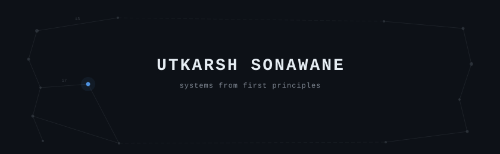

<picture>
  <source media="(prefers-color-scheme: dark)" srcset="assets/generated/hero-dark.svg">
  <source media="(prefers-color-scheme: light)" srcset="assets/generated/hero-light.svg">
  
</picture>

  

Computer Science · Penn State · December 2028

[website](https://sonawaneutkarsh.github.io/) &nbsp;·&nbsp;
[linkedin](https://linkedin.com/in/sonawaneutkarsh) &nbsp;·&nbsp;
[email](mailto:utkarshsonawane@psu.edu)

&nbsp;

CS student at Penn State. I build systems from first principles — algorithms,
infrastructure, and grounded AI where decisions can be traced back to evidence.

I'm usually most interested in what sits underneath the abstraction: why a model
behaves the way it does, what happens when an API fails halfway through a sync,
or whether a metric actually measures what we think it measures.

&nbsp;

### stack

<samp>python &nbsp; typescript &nbsp; javascript &nbsp; java &nbsp; c++ &nbsp; swift &nbsp; sql</samp> 
<samp>fastapi &nbsp; postgres &nbsp; supabase &nbsp; react &nbsp; pytorch &nbsp; pgvector &nbsp; healthkit &nbsp; docker &nbsp; git &nbsp; linux</samp>

&nbsp;

### selected work

**Nytr** &nbsp;·&nbsp; <samp>python, fastapi, postgresql, supabase, swiftui, healthkit</samp> 
Evidence-driven nutrition and training system combining Penn State dining data,
Apple HealthKit, and Hevy resistance-training history. Built around explicit
source authority, immutable revision history, deterministic calculations, and
PostgreSQL/Supabase with Row Level Security — not LLM estimates.

**[Clage](https://github.com/sonawaneutkarsh/Clage)** &nbsp;·&nbsp; <samp>python, neuroevolution, artificial life</samp> 
NEAT implemented from scratch — genome encoding, innovation tracking, mutation,
crossover, and speciation without third-party neuroevolution libraries (188 tests).
Validated on logic/function benchmarks (OR, AND, XOR, sin) and evaluated inside
a seeded 2D artificial-life environment with controlled experiment configurations
and behavioral metrics.

**[Devvy](https://github.com/sonawaneutkarsh/devvy)** &nbsp;·&nbsp; <samp>typescript, node.js, discord ipc</samp> 
Zero-dependency local daemon speaking Discord's IPC protocol directly — socket
discovery, opcode framing, backoff reconnect — to arbitrate Rich Presence
across VS Code, OpenCode, and Command Code with priority, heartbeats, TTL
expiry, and privacy boundaries.

**[ScholarAI](https://github.com/faridabachir769-code/USAII_GlobalAI-Hackathon-2026_ScholarAI)** &nbsp;·&nbsp; <samp>python, pgvector, supabase, fastapi</samp> 
USAII Global AI Hackathon 2026 finalist (6,081+ participants, 5-person team).
Data engineer: normalized 1,000+ government schemes into structured data,
generated vector embeddings, and built the PostgreSQL/pgvector retrieval layer.

 

more &rarr; [MedClarity](https://github.com/sonawaneutkarsh/MedClarity) · [ESP32 Plant Monitor](https://github.com/sonawaneutkarsh/esp32-soil-moisture-monitor) · [all repositories](https://github.com/sonawaneutkarsh?tab=repositories)

&nbsp;

### activity

<picture>
  <source media="(prefers-color-scheme: dark)" srcset="assets/generated/activity-dark.svg">
  <source media="(prefers-color-scheme: light)" srcset="assets/generated/activity-light.svg">
  
</picture>

&nbsp;

---

The graphics on this profile are generated by a
<a href="scripts/generate_profile.py">Python script</a> in this repository.
A scheduled GitHub Action fetches contribution data and regenerates the activity
SVG daily. No third-party profile-widget services are used.

